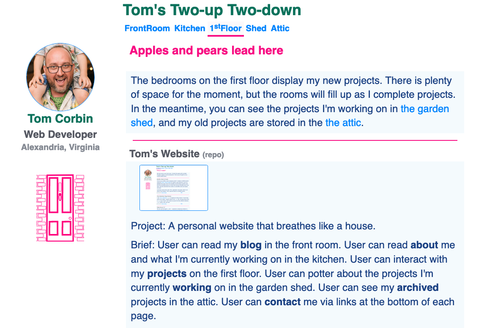

# Tom's Two-up Two-down

## Project

A personal website that breathes like a house.

Website: https://www.thwcorbin.com

## Description

Users can read my **blog** in the front room. Users can read **about** me and what I'm currently working on in the kitchen. Users can view my **portfolio** on the first floor. Users can potter about the projects I'm currently **working** on in the garden shed. Users can see my projects **archive** in the attic. Users can **contact** me via links at the bottom of each page.

## Background

We own a terraced house in Cambridge, England. It's a [two-up two-down](https://dictionary.cambridge.org/dictionary/english/two-up-two-down "Definition of two-up two-down") with a kitchen extension and an attic conversion. We call it the Red Door. I was thinking about our house when I started JAMstacking my website with a blog, updated projects, and a new theme. My website breathes like a house. Sometimes you can feel a draught, but the radiators keep it cozy.

## Status

Living.

## Technologies

- JavaScript
- HTML
- CSS
- Nunjucks
- Markdown
- Eleventy (11ty)
- Rollup

## Installation

- Clone the repo: https://github.com/ThwCorbin/toms-site
- `cd` to the toms-site directory
- run `npm i` in the terminal

## License

[MIT](LICENSE.txt "MIT License text file")
