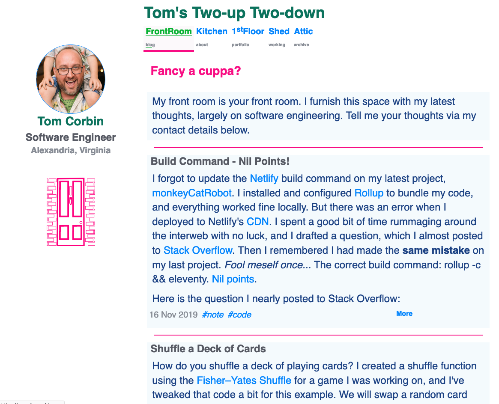

# Tom's Two-up Two-down

## Project

A personal website that breathes like a house.

## Brief

User can read my **blog** in the front room. User can read **about** me and what I'm currently working on in the kitchen. User can interact with my **projects** on the first floor. User can potter about the projects I'm currently **working** on in the garden shed. User can see my **archived** projects in the attic. User can **contact** me via links at the bottom of each page.

## Background

We own a terraced house in Cambridge, England. It's a [two-up two-down](https://dictionary.cambridge.org/dictionary/english/two-up-two-down "Definition of two-up two-down") with a kitchen extension and an attic conversion. We call it the Red Door. I was thinking about our house when I started JAMstacking my website with a blog, updated projects, and a new theme. My website breathes like a house. Sometimes you can feel a draught, but the radiators keep it cozy.

## Status

Living.
